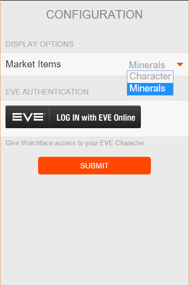

# Time for EVE
EVE Online CREST API based Pebble Watchface

# Displays

- Local Time (Top)
- EVE Time
- EVE Server   
    - Status
    - User Count
- Market
    - Character Related
        - PLEX
        - Skill Injectors/Extractors
    - Minerals
    - Isotopes
    - Planetary
    - High-Tech
- Character (requires CREST authorization)
    - Name
    - Location 
    
Collects latest market information as it becomes available.

Updates server info or character location (if online) and cycles through market items either half hourly or at a flick of the wrist (y-axis acc.).

When character not logged on, displays last seen location with a tap of the screen (z-axis acc.).

# Configuration

Configure market information and authorize watch face to track character location

If you don't have a [Pebble Watch](https://www.pebble.com/) you can:

[Import into CloudPebble](https://cloudpebble.net/ide/import/github/batstyx/time-for-eve/)

